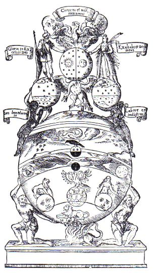

There is a common parable often used in spiritual circles, all slightly different with varying sources and influences, but always following the same line:

> _A professor comes to learn from a wise Zen master, but it quickly >becomes obvious to the Zen master that this professor is more interested >in showing off his own knowledge then in learning. He interrupts the Zen >master. He follows each story the Zen master tells with a story of his >own instead of really listening (You know the type, the person who has to >top your story about loss or success, or a failed attempt at something >with one of their own instead of hearing you out and empathising.). So >the Zen master begins to pour a cup of tea. He fills the cup and keeps >pouring, so that the cup is overflowing._

> _The professor stops him, saying the cup is overflowing, no more will fit >in. The Zen master says to the professor, before you can really learn ?>something you have to empty your cup._

At this point the author will usually point to the necessity for maintaining an attitude of an open mind without preconceived ideas in order to allow the revealing of the true nature of teachings, experiences, etc. This is good! And is so very very important when delving into the search for the Self.

But what then? When we hold an empty cup, what then is allowed to flourish and unfold? What is it that can fill it? The empty cup standpoint becomes the very door through which the unfoldment of our being is allowed to play out. And on the other-side of that door, is not an emptiness. It is not the cessation of something, but is rather the embodiment, the realising of something else.

The purpose of Alchemy is the transmutation of one state to another. And where I feel the literature fails us, and what perhaps can prevent a person really embracing a spiritual path, is that it never truly elaborates on the fact that the things we can experience during that transition is so much more exciting and fulfilling than anything our minds can persuade our attention with. Now part of this is because of the difficulty in relating experiences. We are used to a language associated with the mind, and where there is no mind, the language is vastly different. However it’s important to know that walking a path geared towards transformation is not just going to change the parts of you that you want changed. It can potentially completely change who you are.
When you engage with alchemical processes you ignite something which can be called The Process.

The Process is at one time descriptive of the practices done in order to promote change in ourselves, but it also describes a much more mysterious function that occurs behind the scenes. When you start performing acts whose purpose is to alter and unearth who we are you start churning the entire system. In a soup, if you remove the carrots you change the flavour of the entire pot. So while at the onset it might seem that your efforts are singularly directed at the thing about yourself you want to change the most, you are in actual fact changing your entire being. It is important to realise that it is impossible to change one thing in your energetic system without it having an effect on anything else. We are an energetic ecology; everything is related. And this is The Process: the behind the scenes churning and cooking of your entire being.

This process is essentially just a speeding up of the progress a person would make naturally. The beauty of the Process is that as long as you are engaged in practices geared towards a deep exploration or transformation of the self, the Process will continue. If you want the Process to speed up, do more practices, engage more Will, do more and see more. The Process is a self regulating activity pertaining to the abilities of the individual. This transformation is something that occurs in everyone, regardless of whether they are engaged in self transformation or not. It’s a part of nature. Alchemy is just the speeding up of that transformation, the acceleration of the natural process of evolution.

So what does it do? It changes you. And I mean that literally. And perhaps not in the ways you might initially assume. And because the Process is individual, the changes that occur can appear differently dependant on the person because we all have totally unique energetic make-ups. But beyond the surface level the Process is in actual fact enacting the very same change in everybody: it is clarifying out the parts of you which have a greater amount of integrity. The parts of you which have a greater capacity to hold and cognise a further unfoldment of consciousness. And then as that level of consciousness unfolds, and begins churning our being, we clarify out levels of even greater integrity. And so on and so forth.

This journey of self-realising can take on amazing proportions. And not just in the shaping of the energetic structure but by the standpoint that comes from awareness being exposed to realms of greater subtlety and higher integrity. The world becomes different because the lens through which you are seeing it has changed. Things that may have seemed mundane to you before can become alive with new meaning. You start seeing patterns in life that engross your attention, start seeing the whispers of times past in the relations between seemingly distant things.

You start seeing the inter-connectedness of everything.

And in that realisation you can find your place in creation.

Emotional life is so dull by comparison. When your awareness starts aligning to the higher parts of yourself, there is a whole new body of experiences just waiting for you to identify with. And I mean vastly more than what our minds can offer us.

The mind has a limited array of responses and experiences. The mind is that boring person at the party that always has the same thing to say to everyone and drinks the same cocktail because it has some story behind it that they can use as an ice-breaker. It is predictable, self-satisfying and really boring to be around. The levels beyond the mind has the unpredictable excitement that can lead you to places and experiences that will forever change your trajectory in life. It is joy, it is power, it is compassion, it is wonder and awe and curiosity. It is Life. And it becomes your life and enthuses every facet of your being.

Spiritual practice is not the cessation of the mind but the embracing of that part of you that is closer to the Self. Quieting the mind is only the start. It is the first step towards the experience of our more enlivened levels. And when you start seeing and feeling what is beyond our mundane level, you will want to keep feeling it, and experiencing it and eventually you will find that more and more of your life is experienced on that level, and not the mind. And because you have structured yourself to be in these levels, more experiences and more beautifully intense things await for your perusal. Because you have taken the step, and the path is now open to you.

And infinity no longer comes a conceptual paradox, but the edge upon which your gaze lingers.
